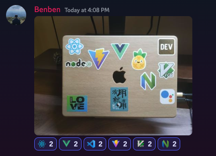
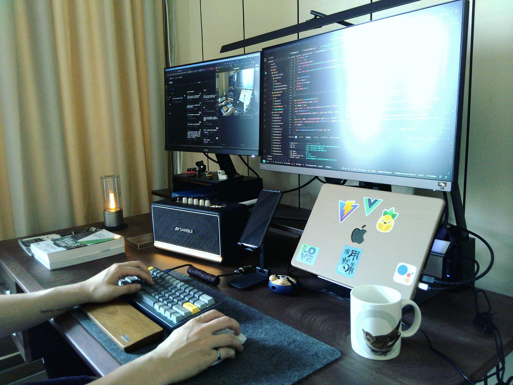

# Documents

> ! This is a document for who taking over my projects and write some principles for myself. !
> Maybe I just put in codes randomly and you saw it, no matter how, welcome as well.

Hi, there!

I follow most style guides beneath and I suggest to overview these guides as well if you are taking over my project or stuff.

Some of them are interesting blog posts with cases and scenario, no just boring rules line by line.

Again, these are all my personal preferences, if you have better solutions then good for you and go for it. Don't tell me you just want dirty codes(Do you even hear brainf\*\*k before?) so you don't want to follow any rules.

Still, I studied and researched a lot so that I found these guides are useful for me.

Then, let's check out.

## Shortcut

- [Documents](#documents)
  - [Shortcut](#shortcut)
  - [IDE](#ide)
  - [Style](#style)
  - [Documentation](#documentation)
  - [Comment](#comment)
  - [Naming](#naming)
  - [Preference](#preference)
  - [Courses](#courses)
  - [In use](#in-use)
  - [License](#license)

[⬆️ Go to Top](#shortcut)

## IDE

- I am currently using: **NeoVim/LazyVim** + **Warp** terminal
- Here are my recommendation as a new developer, still you can chose your preferences as well.
- IDE: [**VScode**](https://code.visualstudio.com/download)
- VScode plugin:
  - `TODO tree`
  - `comment light`
  - `GitLens`
  - `Git Graph`
  - `Git History`
  - `Gremlins tracker for Visual Studio Code`
  - `DotENV`
  - `EditorConfig for Visual Studio Code`
  - `Vim` (Optional)

[⬆️ Go to Top](#shortcut)

## Style

- !(Highly recommend) **Technical Writing**: [Technical Writing for Developers | CSS-Tricks - CSS-Tricks](https://css-tricks.com/technical-writing-for-developers/#top-of-site)
- Writing
  - Chinese Writing style: [中文排版指北](https://github.com/sparanoid/chinese-copywriting-guidelines)
  - Markdown style: [Markdown Lint](https://github.com/DavidAnson/markdownlint/blob/main/doc/Rules.md)
- Coding (Most use JavaScript for Front-End and Back-End)
  - JavaScript style: prefer `standard`
  - [](https://standardjs.com/)

## Documentation

- [Mac File/Folder Naming Guide](the-note-remembers/000-naming.md) - Best practices for naming files and folders on macOS
- [Markdown Syntax Reference](the-note-remembers/001-markdown.md) - Complete Markdown syntax guide with examples
- [Markdown Quick Start](the-note-remembers/002-markdown-tutor.md) - Quick introduction to Markdown for beginners

[⬆️ Go to Top](#shortcut)

## Comment

- Describable comment
  - `TODO:` the part of code to do in the future
  - `FIXME:` the part of code to fix in the future
  - `REF:` reference documents, resources

<details>
  <summary>
  example
  </summary>

```typescript
// REF: https://www.typescriptlang.org/
class item {
  constructor (private name: string) {}

  getItemName: () => this.name

  // FIXME: fix any type
  setItemName: (newName: any) => this.name = newName

  // TODO: add new feature
  someThingNew: () => console.log('new stuff')
}
```

</details>

[⬆️ Go to Top](#shortcut)

## Naming

- JavaScript
  - Conventions: <https://www.robinwieruch.de/javascript-naming-conventions/>
  - Google docs: <https://google.github.io/styleguide/jsguide.html#naming>
- CSS
  - BEM(`block__element--modify`)
- Components
  - Vue Official: <https://vuejs.org/style-guide/> (check section B)
- Hooks, Composables
  - useFeatureA, useFeatureB ...

[⬆️ Go to Top](#shortcut)

## Preference

> Just preference, much depend on projects' needs.

- React/Next (Framework)
  - prefer **React hook** + function component over than class component + function component.
  - often use with: Next, Redux, Formik
  - often css with: Tailwind, Styled-component, Emotions
  - often utils with: Vite, react-use

- Vue/Nuxt (Framework)
  - prefer **Composition Api** rather than Options Api
  - often use with: Nuxt, Vuex(Pinia), VeeValidate
  - often css with: Tailwind, UnoCSS, SCSS
  - often utils with: Vite, vue-use

- CSS
  - prefer **Atomic CSS** like: Tailwind, Windi CSS, UnoCSS ...
  - SCSS/SASS are good as well, but you know naming CSS is a big problem.

- Utils
  - often use: `axios`, `lodash`, `tailwind`
  - package manage: prefer **pnpm > yarn > npm**
  - bundle tools: prefer **vite > parcel > webpack**
  - TypeScript maybe, depend on development timing.
  - Testing maybe, depend on development timing but prefer Vitest.
  - A component is about 300 ~ 500 lines, rely on CSS or some things like that.
  - Restful Api design.
  - Service(call BackEnd Api) separate to files in a same folder to manage them.

[⬆️ Go to Top](#shortcut)

## Courses

For some people curious about courses which I took:

- [Front-End resources(in Chinese)](https://hackmd.io/@benben6515/fe-resource)

[⬆️ Go to Top](#shortcut)

## In use

> Somethings that I am in use when I am coding.

- Laptop: Apple macbook pro M2 14 / 10 cores CPU / 16 cores GPU / 512G / 32G
- Screen: Apple Display (27 inch) + BenQ EW2880u(28 inch)
- Screen bar: Esense LED 11-PRO100
- Keyboards:
  - Keychron HHKB
    - aka, Happy Hacking Keyboard, (\* the best keyboard in the world)
    - Layout: 60%
    - State: Most using
  - Keychron Q60 Max
    - Switch: Nanana
    - Layout: 60%
    - State: When I go out using
- Mouse: \* Real hacker don't need mouse
- Terminal: [Warp](https://app.warp.dev/referral/VLL959)
- Neovim: [Lazyvim](https://www.lazyvim.org/)
- Love themes(VScode):
  1. [ever frost](https://github.com/sainnhe/everforest)
  2. [sonokai](https://github.com/sainnhe/sonokai)
  3. [dracula soft](https://draculatheme.com/visual-studio-code)



> And my lovely stickies. (pretty much my skill)



> I love what I'm doing.

---

If you have any questions or suggestions, you can find my contact information in **[benben.me](https://benben.me)** website.

> Just feel free to AMA (ask me anything), I will reply as soon as possible!

Happy Coding ~

## License

Copyright (c) 2022 - present [@Benben](https://github.com/benben6515)

[MIT License](./LICENSE)
