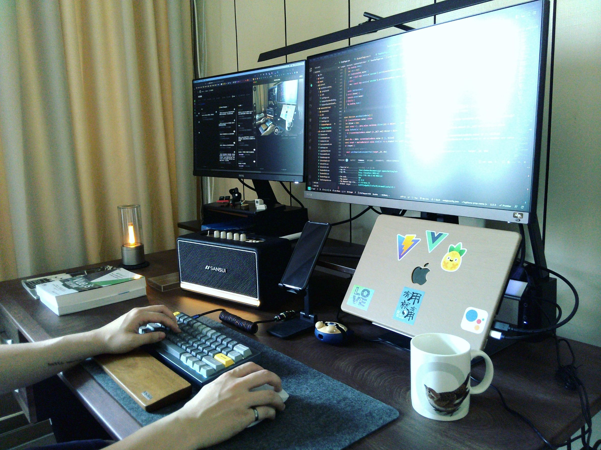

# 文件

> ！這篇主要是寫給交接的人，主要是個人的 coding style, naming 依據等等，順便記錄一下自己的風格！
> 也可能是我放在某些地方，不管怎麼樣，也都歡迎！

嗨！

我遵循以下大部分風格指南，如果你要接手我的專案或相關事務，建議也要瀏覽這些指南。

其中一些是有案例和場景的有趣部落格文章，而不僅僅是枯燥的逐行規則。

再次強調，這些都是我個人的偏好，如果你有更好的解決方案，那對你來說很好，儘管去做。別告訴我你只想要髒代碼（你聽過 brainf\*\*k 嗎？），所以你不想遵循任何規則。

儘管如此，我研究了很多，發現這些指南對我很有用。

那麼，讓我們來看看吧。

## 快速導航

- [文件](#文件)
  - [快速導航](#快速導航)
  - [IDE](#ide)
  - [風格](#風格)
  - [文件參考](#文件參考)
  - [註解](#註解)
  - [命名](#命名)
  - [偏好](#偏好)
  - [課程](#課程)
  - [正在使用](#正在使用)
  - [授權](#授權)

[⬆️ 返回頂部](#快速導航)

## IDE

- 我目前正在使用：**NeoVim/LazyVim** + **Warp** 終端機
- 以下是我作為新開發者的推薦，當然你也可以選擇自己的偏好。
- IDE：[**VScode**](https://code.visualstudio.com/download)
- VScode 插件：
  - `TODO tree`
  - `comment light`
  - `GitLens`
  - `Git Graph`
  - `Git History`
  - `Gremlins tracker for Visual Studio Code`
  - `DotENV`
  - `EditorConfig for Visual Studio Code`
  - `Vim`（選項）

[⬆️ 返回頂部](#快速導航)

## 風格

- !(強烈推薦) **技術寫作**：[Technical Writing for Developers | CSS-Tricks - CSS-Tricks](https://css-tricks.com/technical-writing-for-developers/#top-of-site)
- 寫作
  - 中文寫作風格：[中文排版指北](https://github.com/sparanoid/chinese-copywriting-guidelines)
  - Markdown 風格：[Markdown Lint](https://github.com/DavidAnson/markdownlint/blob/main/doc/Rules.md)
- 程式碼（前端和後端主要使用 JavaScript）
  - JavaScript 風格：偏好 `standard`
  - [](https://standardjs.com/)

## 文件參考

- [Mac 檔案/資料夾命名指南](the-note-remembers/000-naming.tw.md) - macOS 上檔案和資料夾命名的最佳實踐
- [Markdown 語法參考](the-note-remembers/001-markdown.tw.md) - 完整的 Markdown 語法指南與範例
- [Markdown 快速入門](the-note-remembers/002-markdown-tutor.tw.md) - Markdown 初學者快速入門指南

[⬆️ 返回頂部](#快速導航)

## 註解

- 可描述的註解
  - `TODO:` 未來要做的程式碼部分
  - `FIXME:` 未來要修正的程式碼部分
  - `REF:` 參考文件、資源

<details>
  <summary>
  範例
  </summary>

```typescript
// REF: https://www.typescriptlang.org/
class item {
  constructor (private name: string) {}

  getItemName: () => this.name

  // FIXME: 修正 any 類型
  setItemName: (newName: any) => this.name = newName

  // TODO: 新增新功能
  someThingNew: () => console.log('new stuff')
}
```

</details>

[⬆️ 返回頂部](#快速導航)

## 命名

- JavaScript
  - 慣例：<https://www.robinwieruch.de/javascript-naming-conventions/>
  - Google 文件：<https://google.github.io/styleguide/jsguide.html#naming>
- CSS
  - BEM(`block__element--modify`)
- 元件
  - Vue 官方：<https://vuejs.org/style-guide/>（查看章節 B）
- Hooks, Composables
  - useFeatureA, useFeatureB ...

[⬆️ 返回頂部](#快速導航)

## 偏好

> 只是偏好，很大程度上取決於專案需求。

- React/Next (框架)
  - 偏好 **React hook** + 函式元件勝過類別元件 + 函式元件
  - 經常搭配使用：Next, Redux, Formik
  - 經常使用的 CSS：Tailwind, Styled-component, Emotions
  - 經常使用的工具：Vite, react-use

- Vue/Nuxt (框架)
  - 偏好 **Composition Api** 而非 Options Api
  - 經常搭配使用：Nuxt, Vuex(Pinia), VeeValidate
  - 經常使用的 CSS：Tailwind, UnoCSS, SCSS
  - 經常使用的工具：Vite, vue-use

- CSS
  - 偏好 **Atomic CSS** 例如：Tailwind, Windi CSS, UnoCSS ...
  - SCSS/SASS 也不錯，但你知道命名 CSS 是個大問題

- 工具
  - 經常使用：`axios`, `lodash`, `tailwind`
  - 套件管理：偏好 **pnpm > yarn > npm**
  - 打包工具：偏好 **vite > parcel > webpack**
  - TypeScript 也許，取決於開發時機
  - 測試也許，取決於開發時機但偏好 Vitest
  - 一個元件大約 300 ~ 500 行，依賴 CSS 或類似的東西
  - Restful Api 設計
  - Service（呼叫後端 API）分離到同一個資料夾的檔案來管理它們

[⬆️ 返回頂部](#快速導航)

## 課程

對於一些好奇我上過什麼課程的人：

- [Front-End resources(中文)](https://hackmd.io/@benben6515/fe-resource)

[⬆️ 返回頂部](#快速導航)

## 正在使用

> 我寫程式時正在使用的東西

- Laptop: Apple macbook pro M2 14 / 10 cores CPU / 16 cores GPU / 512G / 32G
- Screen: Apple Display (27 inch) + BenQ EW2880u(28 inch)
- Screen bar: Esense LED 11-PRO100
- Keyboards:
  - Keychron HHKB
    - aka, Happy Hacking Keyboard, (\* 世界上最好的鍵盤)
    - Layout: 60%
    - State: Most using
  - Keychron Q60 Max
    - Switch: Nanana
    - Layout: 60%
    - State: When I go out using
- Mouse: \* 真正的駭客不需要滑鼠
- Terminal: [Warp](https://app.warp.dev/referral/VLL959)
- Neovim: [Lazyvim](https://www.lazyvim.org/)
- Love themes(VScode):
  1. [ever frost](https://github.com/sainnhe/everforest)
  2. [sonokai](https://github.com/sainnhe/sonokai)
  3. [dracula soft](https://draculatheme.com/visual-studio-code)


> 還有我可愛的貼紙們。（這幾乎就是我的技能 😂）



> 我熱愛我在做的事。

---

如果你有任何問題或建議，你可以在 **[benben.me](https://benben.me)** 聯絡到我。

> 歡迎隨時問我任何事，我會儘快回覆！

開心寫程式吧 ~

## 授權

Copyright (c) 2022 - present [@Benben](https://github.com/benben6515)

[MIT License](./LICENSE)
